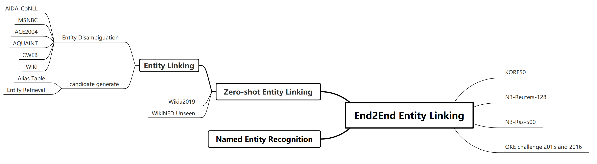
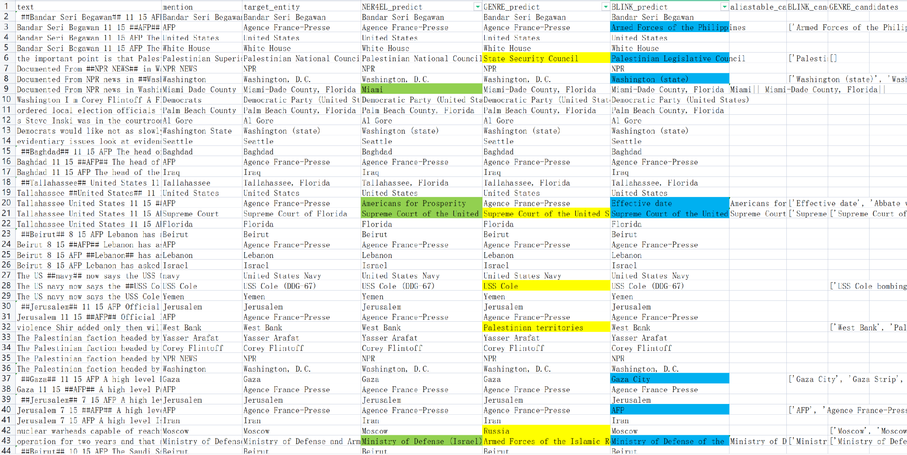

# Entity_Linking

### 名词解释：
- **Token**：句子经分词预处理后进入Embedding的最小单元
- **Mention**：探测到的待链接词（或词组）
- **Context**：Mention左右的多个token，即“上下文”，通常为编码方便选用上下各64或128
- **Entity**：知识库中mention真正的全称，格式非常标准
- **Description**：Wikipedia中对entity的描述片段，通常用来当做entity的特征进行Embedding
- **End2End**：给定一个句子，直接生成mention的位置和对应Entity，示例见End2End Entity Linking输入输出格式
- **Zero-shot**：训练过程中的实体和测试时的实体完全不同

### 概念明确 （论文标题中相似的名词很多，列在这里以便区分）:

- **实体对齐（Entity Alignment）**：目标是在两个不同知识图谱之间，将相同的实体对应起来
- **实体解析（Entity Resolution）**：有时候也叫共指消解（Coherence Resolution），句子中经常会有“他/她/它/这/那”等代词，实体解析负责验证句子中的两个mention是否指向同一个entity，通常是对重复节点的数据删除。
- **实体消歧（Entity Disambiguation）**：目标是找到句子里mention对应到知识库（KB，Knowledge Base. 如Wikipedia）或知识图谱（KB, Knowledge Graph. 如YAGO/DBpedia/Freebase）中的entity。实体消岐可以当做是实体链接任务的一部分，重点在于区分候选实体间的不同，并选出最佳匹配（Gold Entity），因此候选实体经常使用别名表（Alias Table）。很多论文做的实际是Entity Disambiguation，但也把自己的标题起做Entity Linking。
- **实体链接（Entity Linking）**：在实体消岐基础上加一步实体检索（Entity Retrieval）来生成候选实体，便于应对人工Alias Table覆盖不全的问题。此外完整的步骤应该还包括对无对应entity的mention（NIL）进行处理。

### 层级式任务结构图
无框条目为数据集或所用资源，有框条目为任务场景，层级越高任务越全面

以下为实验的case展示，有色条目为分错案例

查看方法1：看只有一个颜色的->表示这个模型特有的问题

查看方法2：看三个颜色共有的错误->数据集的难点

